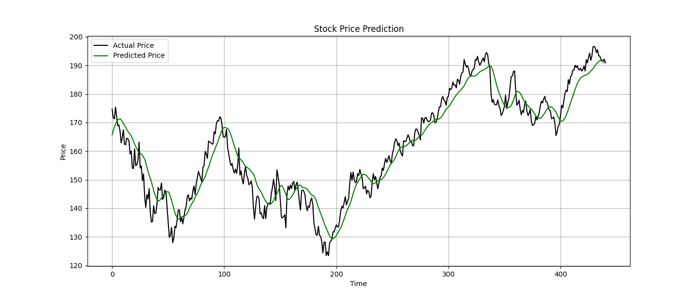

# 📈 Stock Market Analysis using LSTM

This project leverages Long Short-Term Memory (LSTM) neural networks to predict future stock prices based on historical data. The model is trained on Apple Inc. (AAPL) stock prices using data from Yahoo Finance.



## 📂 Project Structure

- `stock_predictor.py`: Main script to train and evaluate the LSTM model.
- `output_plot.png`: Visualization of predicted vs actual stock prices.
- `stock_lstm_model.keras`: Saved Keras model in the recommended format.

## 🔧 Technologies Used

- Python 3.x
- [yfinance](https://pypi.org/project/yfinance/) – For downloading historical stock data.
- [TensorFlow/Keras](https://www.tensorflow.org/) – For building and training LSTM models.
- [scikit-learn](https://scikit-learn.org/) – For preprocessing and evaluation.
- [Matplotlib](https://matplotlib.org/) – For plotting results.

## 📊 Model Summary

- Model Type: Sequential LSTM
- Layers:
  - 2 LSTM layers (50 units each)
  - 1 Dense output layer
- Loss: Mean Squared Error
- Optimizer: Adam
- Epochs: 10
- Sequence Length: 60 (days)

## 📈 Performance Metrics

Evaluated on 20% test data:

```python
from sklearn.metrics import mean_squared_error, mean_absolute_error
import numpy as np

mse = mean_squared_error(actual_prices, predicted_prices)
rmse = np.sqrt(mse)
mae = mean_absolute_error(actual_prices, predicted_prices)

print(f"MSE: {mse}")
print(f"RMSE: {rmse}")
print(f"MAE: {mae}")


🚀 Future Enhancements
 Add support for multiple stock tickers (e.g., TSLA, MSFT)

 Deploy as a Streamlit or Flask web app

 Experiment with GRU and Transformer-based models

 Add sentiment analysis from financial news

 Integrate with real-time APIs for live predictions

👤 Author
Made with ❤️ by Amisha Singh
🔗 GitHub Profile
```
